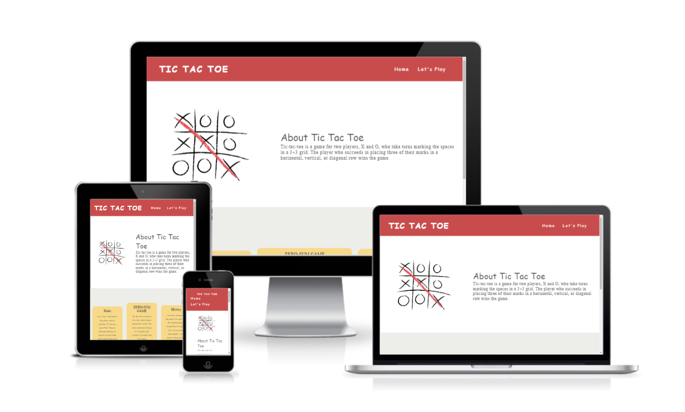

# Tictactoe

[View the live project here.](https://mahsak89.github.io/Tictactoe/)

A simple and fun game for 2 players.

- ### **Structure**

  - #### First and third section(header and footer):

    - The website consist of 2 pages named: Home and Let's Play. Each page has three sections.

    - The content of the header and footer sections are the same in both the pages. The Header section consists of the navbar menu for navigation through the website and the footer section consists of the Contact button, More games, and social media links.

  - #### Second section:

    - **Home pages**

     -expaine about the game in the first section and down we have the another section with 3 colorful boxes which giv us more information,
    - **let's play page**

     - On this page, there is also a a game box with tails wich added click sound on each tails. there is also a game winner text box who sho up after you are done with the game and show us, if we have a winner or if it is a draw.
     

    
   

